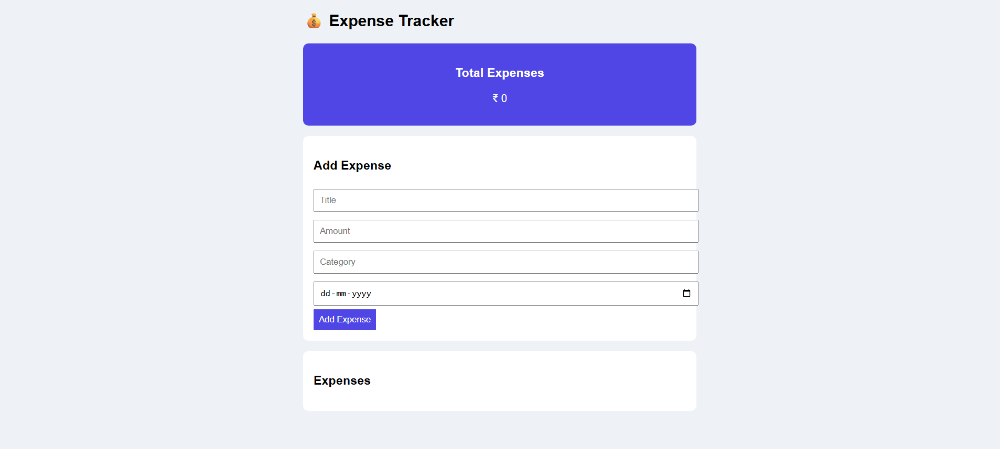
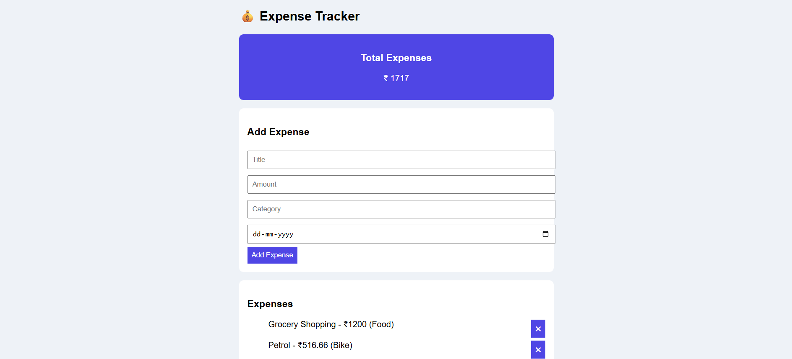

# Expense Tracker Application

A full-stack Expense Tracker application built using Spring Boot and React with a clean card-based UI.

## Features

- Add daily expenses with title, amount, category, and date
- View all expenses
- Delete expenses
- View total expense summary
- Backend validation and global exception handling

## Tech Stack

- Backend: Java, Spring Boot, JPA, H2
- Frontend: React, JavaScript, CSS
- Tools: Git, GitHub

## Example Usage

- Title: Grocery Shopping
- Amount: 1200
- Category: Food
- Date: 2026-01-10

## How to Run

1. Run backend on port 8080
2. Start frontend using `npm start`
3. Open http://localhost:3000

## Screenshots

### Expense Dashboard

### Add Expense

